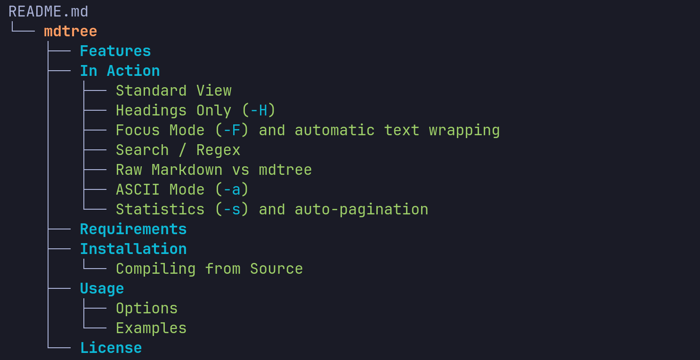
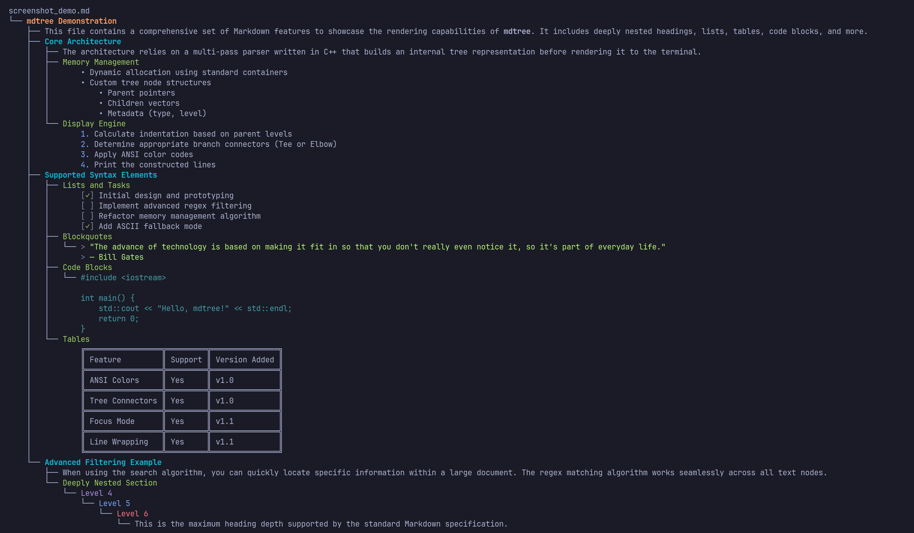
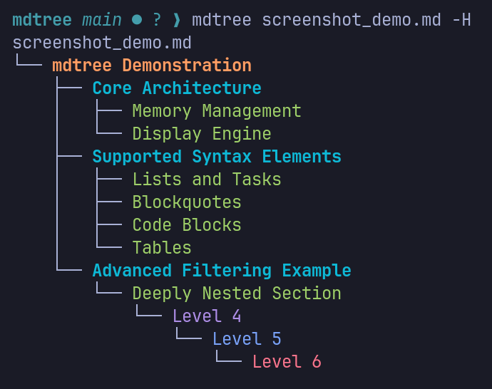
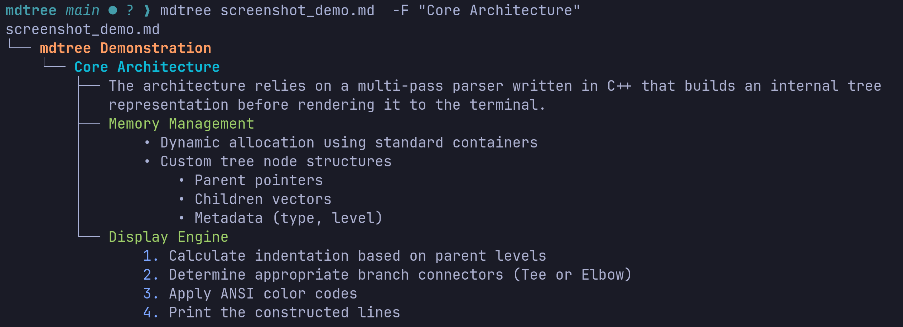
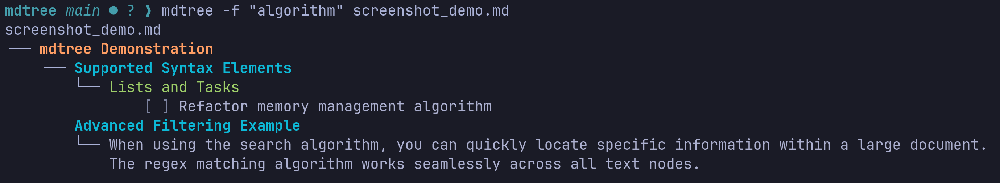
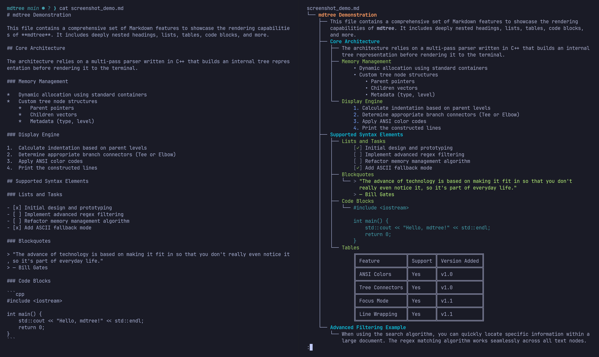
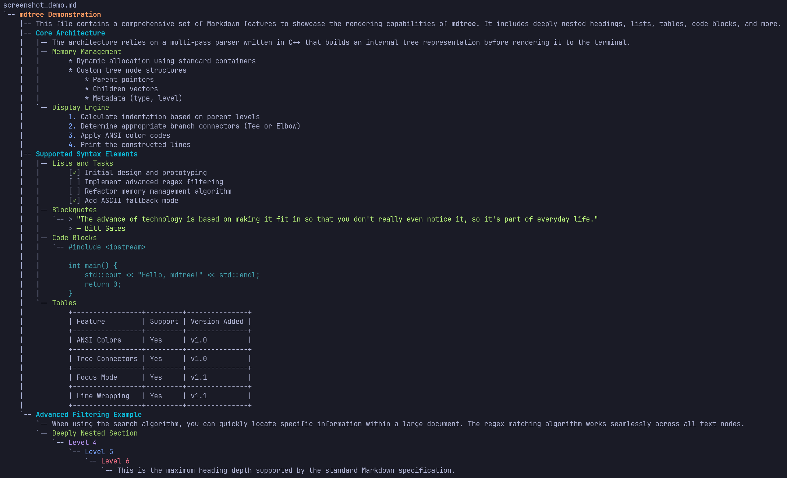
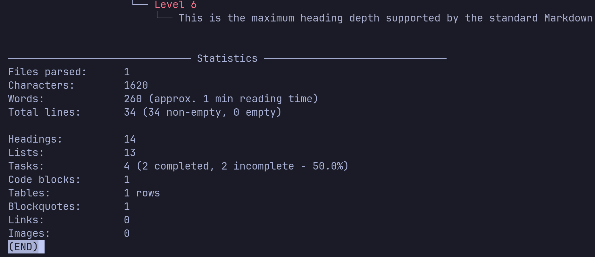

# mdtree

`mdtree` is a highly customizable, C++ command-line utility that reads Markdown files and outputs their structural representation, similar to how the `tree` command visualizes directory structures.

*Example: The structure of this very `README.md` file, as generated by `mdtree`:*



Markdown documents often become difficult to navigate once they reach hundreds or thousands of lines. `mdtree` provides a tree representation that makes exploring document structure significantly faster without opening an editor.

It provides an elegant, color-coded way to quickly review document hierarchies, view headings, content, lists, blockquotes, and tables without opening the file in an editor. Supports Markdown syntax including headings, unordered/ordered lists, task lists, blockquotes, fenced code blocks, tables, and horizontal rules.

## Features

- **Focus Mode (`-F`):** Zoom in on a specific section of a massive markdown document by providing a regex query. `mdtree` will trace back the parent headings for context while rendering only that section's subtree.
- **Beautiful Tree Rendering:** Uses ANSI colors and Unicode box-drawing characters for a clean, readable tree view.
- **Smart Line Wrapping:** Intelligently wraps content, lists, code blocks, and blockquotes based on your terminal's width without breaking formatting.
- **Automatic Pagination:** For large documents, `mdtree` buffers output and pipes it directly to `less` when output exceeds terminal height (can be disabled via `-P`).
- **Search / Regex:** Search the file using specific strings (`-f`) or regular expressions (`-r`).
- **Comprehensive Markdown Support:** Renders headings, regular text, ordered/unordered lists, task lists, code blocks, tables, and horizontal rules cleanly and intuitively.

## In Action

### Standard View



### Headings Only (`-H`)



### Focus Mode (`-F`) and automatic text wrapping



### Search / Regex



### Raw Markdown vs mdtree



### ASCII Mode (`-a`)



### Statistics (`-s`) and auto-pagination



## Requirements

* C++17 compatible compiler
* `make`
* POSIX environment (Linux/macOS)

*Note: Windows is not officially supported yet.*

## Installation

### Compiling from Source

Ensure you meet the requirements above.

```bash
git clone https://github.com/SilverSouls226/mdtree.git
cd mdtree
make
sudo make install
```

This will compile and install the `mdtree` binary to `/usr/local/bin` by default.

To remove the installation later, you can run:

```bash
sudo make uninstall
```

## Usage

Basic usage is straightforward. Pass the path to a markdown file or a directory containing markdown files.

```bash
mdtree my_document.md
```

You can also pass a directory as input to process all markdown files inside it:

```bash
mdtree docs/
```

### Options

| Flag | Long Flag | Description |
| :--- | :--- | :--- |
| `-d` | `--depth <level>`     | Limit the display to a certain heading level (1-6). 7 shows all content. |
| `-f` | `--find <string>`     | Search the file for the given string (case-sensitive) and show matched lines. |
| `-i` | `--case-insensitive`  | Make the search case-insensitive when used with `-f` or `-r`. |
| `-r` | `--regex <regex>`     | Search the file using a regular expression. |
| `-I` | `--ignore <regex>`    | Ignore headings (and their children) matching the regex. |
| `-H` | `--headings-only`     | Strictly show only headings (like a Table of Contents). |
| `-F` | `--focus <regex>`     | Focus on the first heading matching the regex and only show its subtree. |
| `-P` | `--no-pager`          | Disable automatic `less` paging. |
| `-c` | `--no-color`          | Disable colored output. |
| `-a` | `--ascii`             | Use ASCII characters for tree branches instead of box-drawing characters. |
| `-s` | `--stats`             | Print statistics about the parsed files at the end. |
| `-n` | `--line-numbers`      | Show original line numbers next to each tree item. |
| `-w` | `--no-warnings`       | Suppress linter warnings at the end of the output. |
| `-v` | `--version`           | Display version information. |
| `-h` | `--help`              | Display this help message and exit. |

### Examples

**Show a table of contents (headings only):**
```bash
mdtree -H README.md
```

**Focus on a specific API Endpoint section in a large doc:**
```bash
mdtree -F "API Endpoints" docs.md
```

**Find occurrences of a specific word or phrase:**
```bash
mdtree -f "installation" manual.md
```

**Combine flags for advanced filtering:**
```bash
mdtree -F "Installation" -d 3 README.md
```
```bash
mdtree -I "Deprecated" docs.md
```

## License

This project is licensed under the MIT License - see the [LICENSE](LICENSE) file for details.
